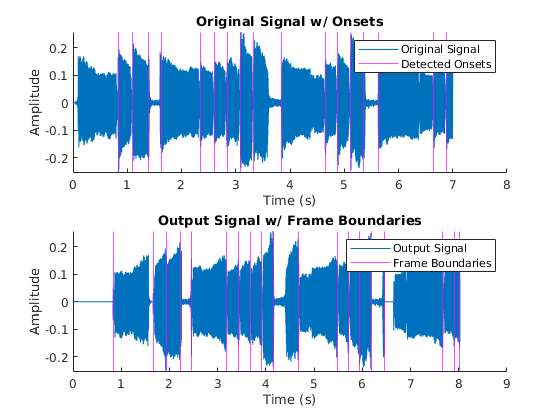

# In-Order Reverse Effects
This project was inspired by reverse delay guitar pedals, where you can set the feedback low, so
that the audio is just reversed one frame at a time. This effect is unique in that it can vary
the size of each frame that is being reversed. It detects onsets for the input signal and uses
those as frame boundaries, so that the order of notes being played remains the same, but each
one's audio is reversed.

This was my project for Audio DSP Portfolio.

## Examples

The Examples/ folder holds previously created figures & audio files.
The SampleAudio/ folder holds audio files that I used to test the algorithm. "riff.wav" works well, the others not so much (due to onset detection issues).

## Contents

The main script is reverser.m. At the top is a line where you can choose the audio file.

Additional functions are stored in copyFromCircularBuf.m, copyToCircularBuf.m, and zeroCircularBuf.m. These are fairly descriptive names, and there are comments within each one that describe their function in more detail.

The class ReverserData.m holds buffers & methods for dealing with those buffers that are used by the main script.

